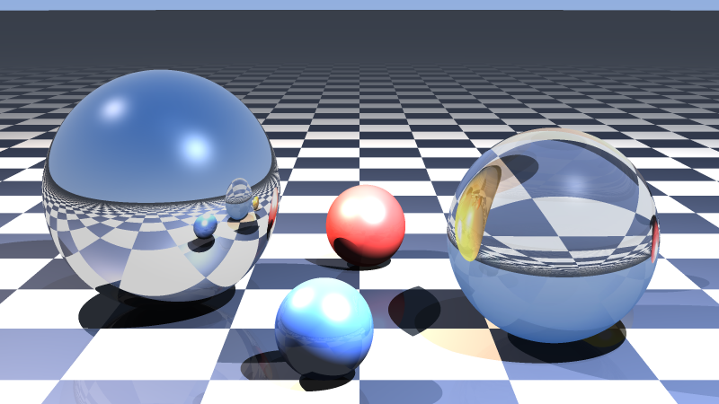
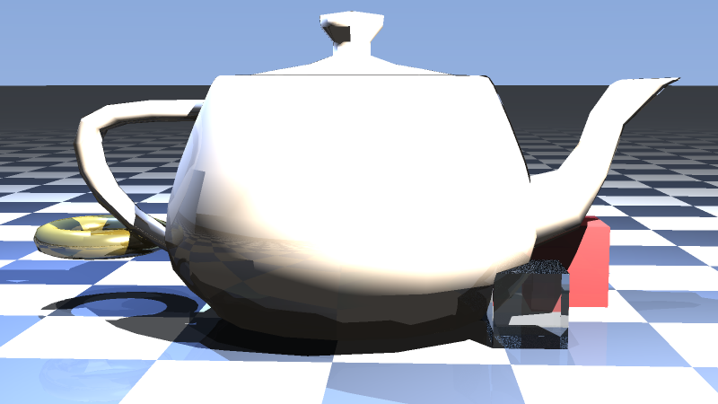

# javaRaytracer

A Java raytracer originally written as a multimedia / computer graphics course project. This revision fixes the shading math, makes the project runnable with Maven, and adds recursive reflections, refraction, anti-aliasing, and demo scenes that use the models actually shipped in the repo.

## Features

- Blinn-Phong shading with working **diffuse**, **specular**, and **ambient** terms
- Hard **shadows** that point at the light and do not wipe other lights
- Recursive **reflection** and **refraction** (Snell + total internal reflection)
- Infinite **checkerboard plane**, **OBJ scale**, and a **sky gradient**
- Parallel pixel rendering and **supersampling** anti-aliasing
- Demo scenes: `spheres` and `teapot`

## Renders

Mirror and glass spheres on a checkerboard floor (800×450, 3×3 AA):



Teapot, ring, and cubes loaded from the included OBJ files (800×450, 2×2 AA):



## Build and run

Requires **JDK 17+** and **Maven**.

```bash
mvn -q test
mvn -q exec:java -Dexec.args="--scene spheres --width 640 --height 360 --samples 2 --out renders/spheres.png"
mvn -q exec:java -Dexec.args="--scene teapot --width 640 --height 360 --samples 2 --out renders/teapot.png"
```

CLI flags:

| Flag | Default | Description |
|------|---------|-------------|
| `--scene` | `spheres` | `spheres`, `teapot`, or `all` |
| `--width` | `640` | Image width |
| `--height` | `360` | Image height |
| `--samples` | `2` | Supersampling grid (`N` × `N`) |
| `--depth` | `5` | Maximum reflection / refraction bounces |
| `--out` | `image.png` | Output PNG path |

`--scene all` writes `renders/spheres.png` and `renders/teapot.png`.

You can also run the jar:

```bash
mvn -q -DskipTests package
java -jar target/java-raytracer-1.0.0.jar --scene spheres --out image.png
```

## What was wrong before

The checked-in scene loaded `SizedJoker3.obj` and `BatarangSized.obj`, which are not in the repository, so the program crashed on startup. Reflection dropped the incident term (`R = I - 2(N·I)N`), shadow rays used the light's world position as a direction, specular used `lightPos + hitPos` instead of Blinn-Phong, and `Material.diffuse` was never applied. `CubeQuad.obj` (faces with missing `vn` data) threw while loading.

Those models are still absent; the demos use `SmallTeapot.obj`, `Ring.obj`, `Cube.obj`, `CubeQuad.obj`, and procedural spheres / planes instead.
